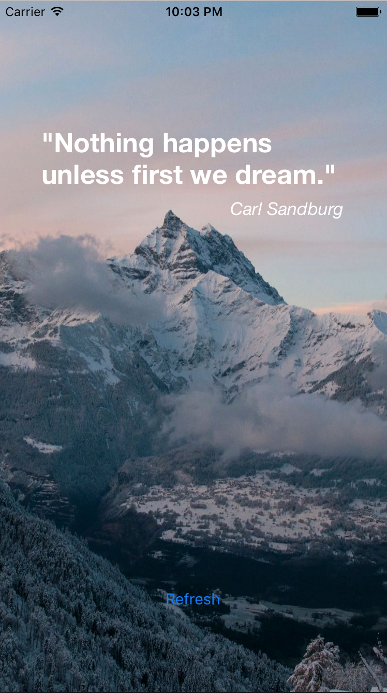

# Quote

This repo contains a simple example on how to use [Moya](https://github.com/Moya/Moya) and [RxSwift](https://github.com/ReactiveX/RxSwift) to download a random image and a random quote and display them:

||  | |
|:-----------------------------------:|:-------------------------------------:|:------------------------------------:|


# Trying it out

Clone the repo, then install dependencies using [CocoaPods](https://guides.cocoapods.org/using/getting-started.html):

```
$ pod install
```

Open the `.xcworkspace` folder in Xcode:

```
$ open Quote.xcworkspace
```

Build and run the application 🙂